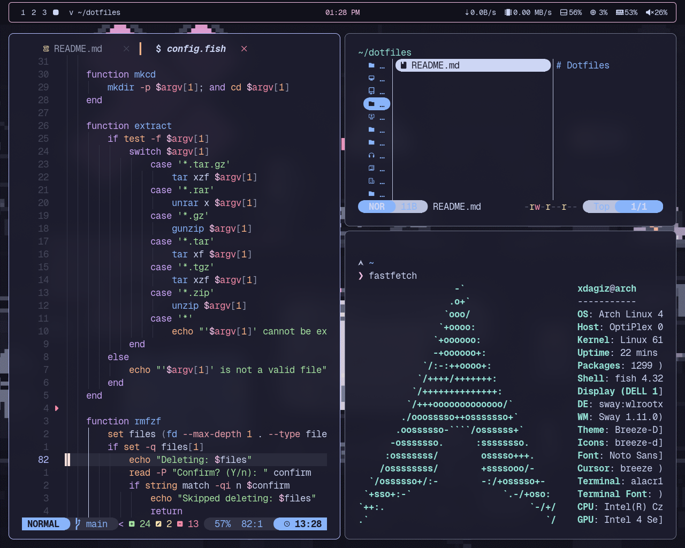
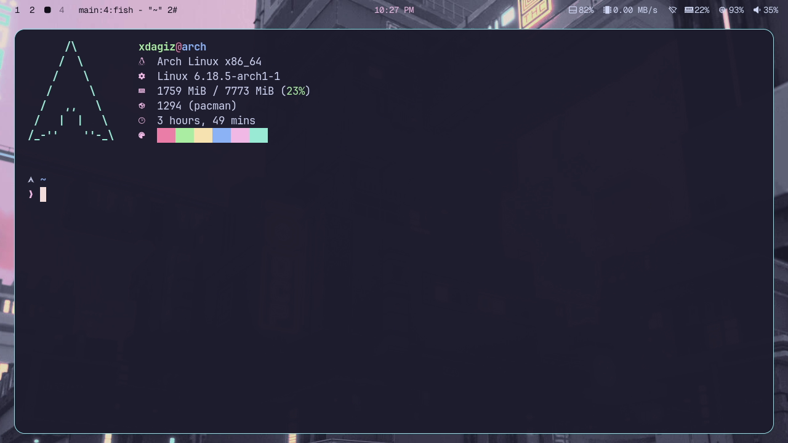
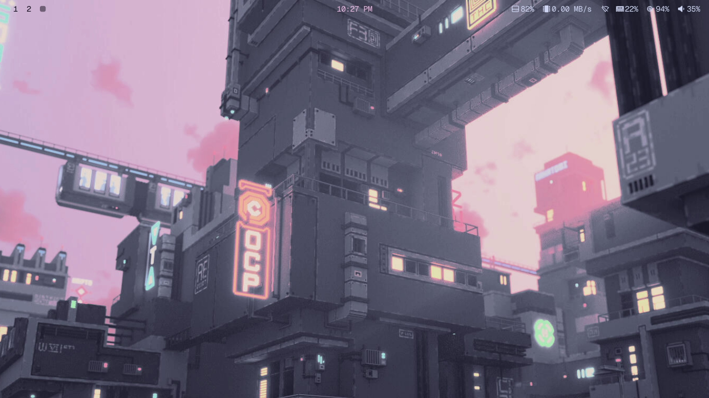
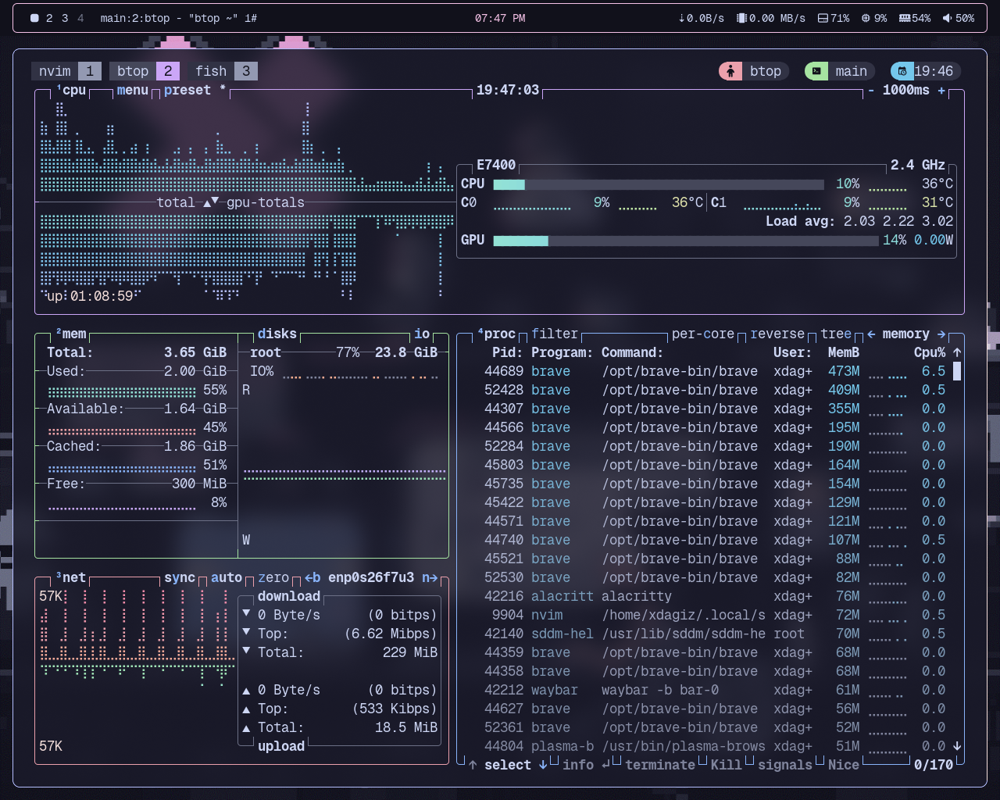
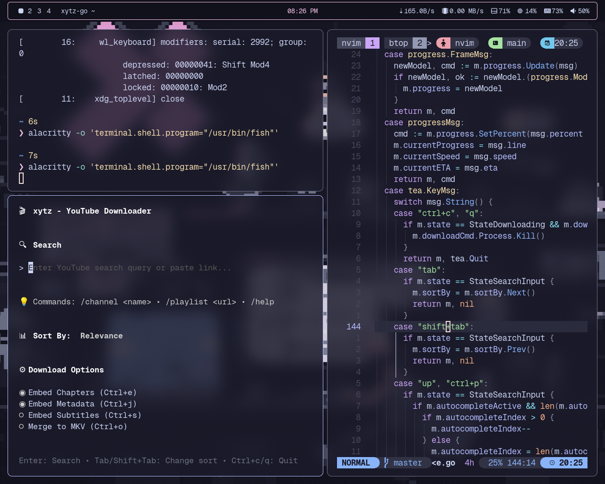

# My Dotfiles

- **Terminal**: Alacritty configuration
- **Editor**: Neovim
- **Shell**: fish + starship
- **WM**: Sway
- **Bar**: Waybar
- **Launcher**: Wofi
- **Colorscheme**: Catppuccin Mocha
- **Other**: tmux, btop, mako, rofi

## Screenshots
<p align="center">
  
  
</p>

<p align="center">
  
  
</p>

<p align="center">
  
</p>

## Installation

```bash
git clone https://github.com/xdagiz/dotfiles ~/dotfiles
cd ~/dotfiles

# If using stow
stow .

# or individually
stow sway waybar alacritty tmux ...
```
